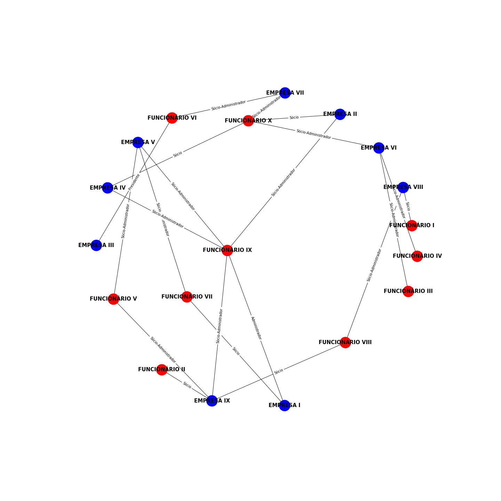

# CNPJ Analysis

This code was developed to analyze the existence of company networks based on Brazilian companies CNPJs,  provided by the  Federal Revenue of Brazil.

## Requirements

Make sure you have R and Python installed. 
To install the needed libraries, run:

```
 $ pip install -r requirements.txt
```
Folder structure to save data should be as follows:

```
.
├── source
├── json_data
|   ├── employees
|   └── companies
├── figure
```
But don't worry, the script automatically creates the folder json_data.

## Download

The data is available on the RFB website, but you can download it via R script using the rfbCNPJ library. This script will download, join and export the data in jsonline format. To get the updated data, run:

```
 $ Rscript rfb_cnpj_download.R --args -path [path-to-save-data]
```

Make sure you have the needed path structure.

## Database

Once you have the full dataset, it'd be nice to insert it on a database. To do so, run the following command:

```
 $ python insert_database.py
```

## Network Analysis

This analysis returns networks of companies and employees that has something in common.

To build the network based on a business partner's name, run:
```
 $ python cnpj_search.py -p [business-partner-name] -n [max-level]
```

To build the network based on a company's CNPJ, run:
```
 $ python cnpj_search.py -c [company-cnpj] -n [max-level]
```
Here is an example of the output we can get.

